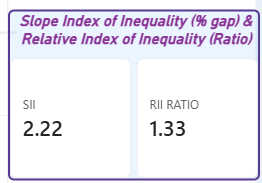

# NHS-health-inequalities-pipeline
End-to-end data processing taking raw public health data from SQL queries into a Power BI model, using DAX for analytical measures, and applying R for visual output.

Hypothesis : London boroughs with higher Index of Multiple Deprivation (IMD) scores exhibit higher rates of recorded diabetes prevalence due to the impact of wider social determinants of health.

The findings validate the hypothesis:



Correlation Analysis:
R = 0.51, p < 0.001
Statistically significant, moderate-strong positive correlation between deprivation rank and diabetes prevalence across Local Authorities.

Absolute Inequality:
SII of 2.22 indicates that moving from the least to the most deprived relative rank accounts for an absolute increase of 2.22 percentage points in diabetes prevalence.

Relative Inequality: 
RII Ratio of 1.33 demonstrates that the predicted diabetes prevalence in the most deprived communities is 1.33 times (33% higher) than that of the least deprived communities.

Interactive Dashboard Overview:


Statistical Methodology & Key Metrics

--Slope Index of Inequality (SII): A population weighted linear regression slop the difference between health outcomes between the most and least deprived relative ranks.

--Relative Index of Inequality (RII Ratio): The ratio of predicted health outcomes at the extremes of deprivation.
```dax
--Core DAX code:
1. Slope Index of Inequality (SII)
'''dax
SII = 
VAR overallTotalPopulation = CALCULATE(
    SUM(Data[Total_Population]
    ),
    ALLSELECTED(Data)
    )
VAR Weighted_X_mean = 0.5

VAR Weighted_Y_mean =
 DIVIDE(
    CALCULATE(
        SUMX(Data, (Data[Diabetes_Prevalence])*Data[Total_Population]), ALLSELECTED(Data)
    ),
    overallTotalPopulation)

VAR Covariancee = 
  CALCULATE(
    SUMX(Data, Data[Total_Population]*(Measures_All[Rank_Midpoint] - Weighted_X_mean)*((Data[Diabetes_Prevalence]) - Weighted_Y_mean)
    ),
     ALLSELECTED(Data))
VAR variancee = 
CALCULATE(
    SUMX(Data, Data[Total_Population]*
    POWER((Measures_All[Rank_Midpoint] - Weighted_X_mean), 2)
    ),
    ALLSELECTED(Data))

    RETURN
    DIVIDE(Covariancee, variancee)

2. Relative Index of Inequality Ratio (RII Ratio)

RII RATIO = 
 VAR OverallTotalPopulation =
 CALCULATE(
    SUM(Data[Total_Population]
    ),
    ALLSELECTED(data)
 )
VAR Weighted_Y_mean =
DIVIDE(
    CALCULATE(
        SUMX(Data, Data[Diabetes_Prevalence]*Data[Total_Population]
        ),
        ALLSELECTED(Data)
    ),
    OverallTotalPopulation)
    
VAR Intercept = 
    Weighted_Y_mean- ([SII] * 0.5)
VAR Rate_Most_deprived = Intercept + [SII]
VAR Rate_least_deprived = Intercept

RETURN
DIVIDE(Rate_Most_deprived, Rate_least_deprived)


